<div align="center">

# 🧠 Arunava De

### AI/ML Engineer · Computer Vision Specialist · MLOps & GenAI

<a href="https://linkedin.com/in/arunavade99" target="_blank" rel="noopener noreferrer"></a>
<a href="https://github.com/arunavade99" target="_blank" rel="noopener noreferrer"></a>
<a href="https://arunavade99.github.io/arunavade99/" target="_blank" rel="noopener noreferrer"></a>
<a href="mailto:arunava_de@outlook.com" target="_blank" rel="noopener noreferrer"></a>
<a href="https://www.instagram.com/arunava_de_official" target="_blank" rel="noopener noreferrer"></a>

📍 **Kolkata, West Bengal, India**

---

### 🚀 Tech Highlights at a Glance


</div>

---

## 👨‍💻 About Me

Computer Vision and AI/ML Engineer with **3+ years** of hands-on experience designing, training, and deploying production-grade AI systems. Specializing in **object detection**, **multi-object tracking**, **face recognition**, and **real-time edge analytics** — taking models from prototype to live factory floor deployment.

> **Production Achievements:** Upgraded industrial PPE detection from YOLOv3 to YOLOv8 with a custom-annotated dataset of **15,000+ images**, built real-time molten metal safety systems, and benchmarked EasyOCR, Textract, and Gemini Flash Pro for high-accuracy ANPR pipelines.

- ⚙️ **Productivity Monitoring:** Building pose-estimation-based worker & machine tracking (YOLO-Pose + Flask dashboard).
- 🏭 **Industrial Vision AI:** Live deployment of real-time camera feed analytics (PPE compliance, molten metal hazard detection).
- 🚗 **ANPR & OCR:** Benchmarking EasyOCR, Amazon Textract, and Gemini Flash Pro using RF-DeTR object detection.
- 👤 **Biometrics & Analytics:** Real-time face recognition attendance & people counting system.
- ☁️ **Cloud & Generative AI:** Hands-on experience with Amazon Bedrock, preparing for **AWS Certified AI Practitioner** certification.

---

## ⚡ AI Engineering Architecture

The graphical visual map below outlines my core technical architecture spanning Computer Vision, Generative AI, MLOps Deployment, and Hardware Edge AI:

### AI Architecture

```mermaid
%%{init: {'theme': 'dark', 'themeVariables': { 'lineColor': '#00dca0', 'primaryColor': '#0b1118', 'primaryBorderColor': '#00dca0', 'primaryTextColor': '#ffffff'} }}%%
flowchart TD
    ROOT["🧠 AI Engineering Architecture"]

    ROOT --> CV["👁️ Computer Vision"]
    ROOT --> GAI["✨ Generative AI"]
    ROOT --> DEP["🚀 Deployment & MLOps"]
    ROOT --> HW["⚡ Hardware & Edge AI"]

    CV --> CV1["🎯 YOLOv8"]
    CV --> CV2["📷 OpenCV"]
    CV --> CV3["🔄 DeepSORT"]
    CV --> CV4["👤 FaceNet"]
    CV --> CV5["🔍 InsightFace"]

    GAI --> GAI1["♊ Gemini"]
    GAI --> GAI2["☁️ Amazon Bedrock"]
    GAI --> GAI3["💬 Prompt Engineering"]

    DEP --> DEP1["🌶️ Flask"]
    DEP --> DEP2["🎸 Django"]
    DEP --> DEP3["☁️ AWS"]
    DEP --> DEP4["🌿 Git"]

    HW --> HW1["🍓 Raspberry Pi"]
    HW --> HW2["📡 PIR Sensors"]
    HW --> HW3["🤖 Embedded AI"]

    classDef rootStyle fill:#0f1923,stroke:#00dca0,stroke-width:3px,color:#ffffff,font-weight:bold;
    classDef cvStyle fill:#0b1821,stroke:#00dca0,stroke-width:2px,color:#00dca0;
    classDef genStyle fill:#1a0f26,stroke:#a855f7,stroke-width:2px,color:#d8b4fe;
    classDef depStyle fill:#091726,stroke:#00b4ff,stroke-width:2px,color:#38bdf8;
    classDef hwStyle fill:#261809,stroke:#ffaa00,stroke-width:2px,color:#fbbf24;

    class ROOT rootStyle;
    class CV cvStyle;
    class GAI genStyle;
    class DEP depStyle;
    class HW hwStyle;
```



<details>
<summary><b>📂 Text Graphical Tree Representation (Click to Expand)</b></summary>

```
AI Engineering Architecture
│
├── 👁️ Computer Vision
│     ├── 🎯 YOLOv8
│     ├── 📷 OpenCV
│     ├── 🔄 DeepSORT
│     ├── 👤 FaceNet
│     └── 🔍 InsightFace
│
├── ✨ Generative AI
│     ├── ♊ Gemini
│     ├── ☁️ Amazon Bedrock
│     └── 💬 Prompt Engineering
│
├── 🚀 Deployment
│     ├── 🌶️ Flask
│     ├── 🎸 Django
│     ├── ☁️ AWS
│     └── 🌿 Git
│
└── ⚡ Hardware AI
      ├── 🍓 Raspberry Pi
      ├── 📡 PIR Sensors
      └── 🤖 Embedded AI
```

</details>

---

## 🛠️ Tech Stack & Skill Matrix

| Category | Skill / Tool Badge | Key Applications & Scope |
|:---|:---|:---|
| **Computer Vision** | `OpenCV` `YOLOv8` `YOLO26` `YOLO-Pose` `InsightFace` `FaceNet` `MediaPipe` `DeepSORT` `RF-DeTR` `Supervision` | Real-time object tracking, safety compliance monitoring, pose estimation, face attendance |
| **Deep Learning** | `PyTorch` `CNNs` `Transfer Learning` `Object Detection` `Image Segmentation` | Custom neural net fine-tuning, dataset annotation, multi-class classification |
| **OCR & GenAI** | `Gemini` `Amazon Bedrock` `EasyOCR` `Amazon Textract` `Mobile SAM` | Multimodal document & license plate extraction, prompt engineering, segmentation |
| **Backend & Web** | `Python` `Flask` `Django` `MySQL` `RESTful APIs` | AI dashboard development, video stream ingestion pipelines, backend REST endpoints |
| **Cloud & DevOps** | `AWS` `Amazon Bedrock` `Git` `GitHub Actions` `Power BI` | Model deployment, dataset management, version control, analytics reporting |
| **Hardware & Edge** | `Raspberry Pi` `PIR Sensors` `Embedded AI` `NVIDIA Jetson` | On-device video inference, IoT sensor trigger automation, edge deployment |

---

<div align="center">

### 📈 Interactive Activity Summary
<a href="https://github.com/arunavade99">
  
</a>

</div>

---

## 💼 Work Experience

### **L2A Software Engineer-I (AI/ML)** — *Adamas Tech Consulting Pvt. Ltd.*
`Feb 2026 – Present` · Kolkata, West Bengal

- 🔹 Engineered worker & machine productivity tracking system using **YOLO-Pose** and interactive **Flask** dashboards.
- 🔹 Developed AI-powered jewelry hand measurement system utilizing **MediaPipe** and **Mobile SAM**.
- 🔹 Built real-time face recognition attendance and automated people counter (**InsightFace** + **YOLOv8**).
- 🔹 Designed ANPR pipeline with **RF-DeTR**, benchmarking **EasyOCR**, **Amazon Textract**, and **Gemini Flash Pro**.

### **Junior Developer (Computer Vision / AI)** — *Xiphos Technology Solutions Pvt. Ltd.*
`Mar 2023 – Jan 2026` · Kolkata, West Bengal

- 🔹 Led architecture migration from **YOLOv3 → YOLOv8**; curated & annotated **15,000+ images** across 6 PPE classes.
- 🔹 Created OpenCV-based molten metal detection system integrated with real-time safety alert triggers.
- 🔹 Deployed vision pipelines in live factory environments with sub-second real-time camera processing.

### **Intern (AI / Computer Vision)** — *Xiphos Technology Solutions Pvt. Ltd.*
`Sep 2022 – Mar 2023` · Kolkata, West Bengal

---

## 🌟 Personal Featured Projects

| Project Name | Highlights & Features | Technologies Used |
|:---|:---|:---|
| 👤 **AI Face Recognition Attendance** | Employee verification with automatic in/out logging, spoof prevention, and log generation | `FaceNet` `OpenCV` `Python` `SQLite` |
| 🚘 **Vehicle Speed & Line-Cross Counter** | Real-time vehicle speed estimation using perspective transformation, virtual calibration lines, and directional counter | `YOLOv8` `DeepSORT` `OpenCV` `Python` |

---

## 🎓 Education & Certifications

### **Education**
- 🎓 **B.Tech in Computer Science & Engineering**
  *Bengal Institute of Technology (TIG), MAKAUT* (`2018 – 2022`) · **CGPA: 8.83 / 10**

### **Certifications**
- 📜 **YOLOv8 & YOLO11: Custom Object Detection & Web Apps** (2025)
- 📜 **PyTorch Deep Learning Bootcamp**
- 📜 **OpenCV Computer Vision Masterclass**
- 📜 **Python for Data Science & Machine Learning**

---

<div align="center">

**<a href="https://arunavade99.github.io/arunavade99/" target="_blank" rel="noopener noreferrer">🌐 Explore My Full Web Portfolio & Projects →</a>**

</div>
